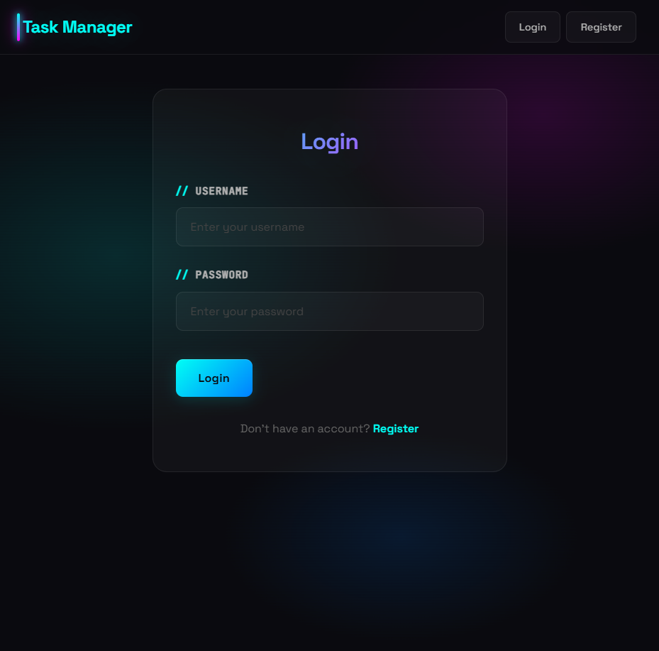
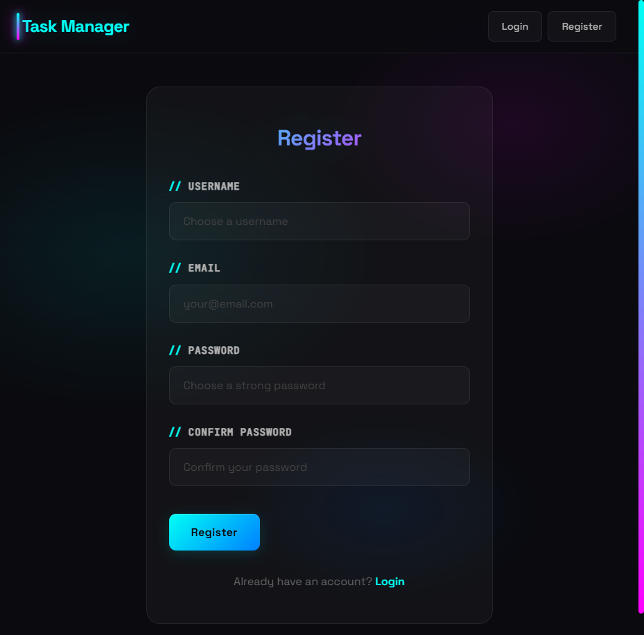
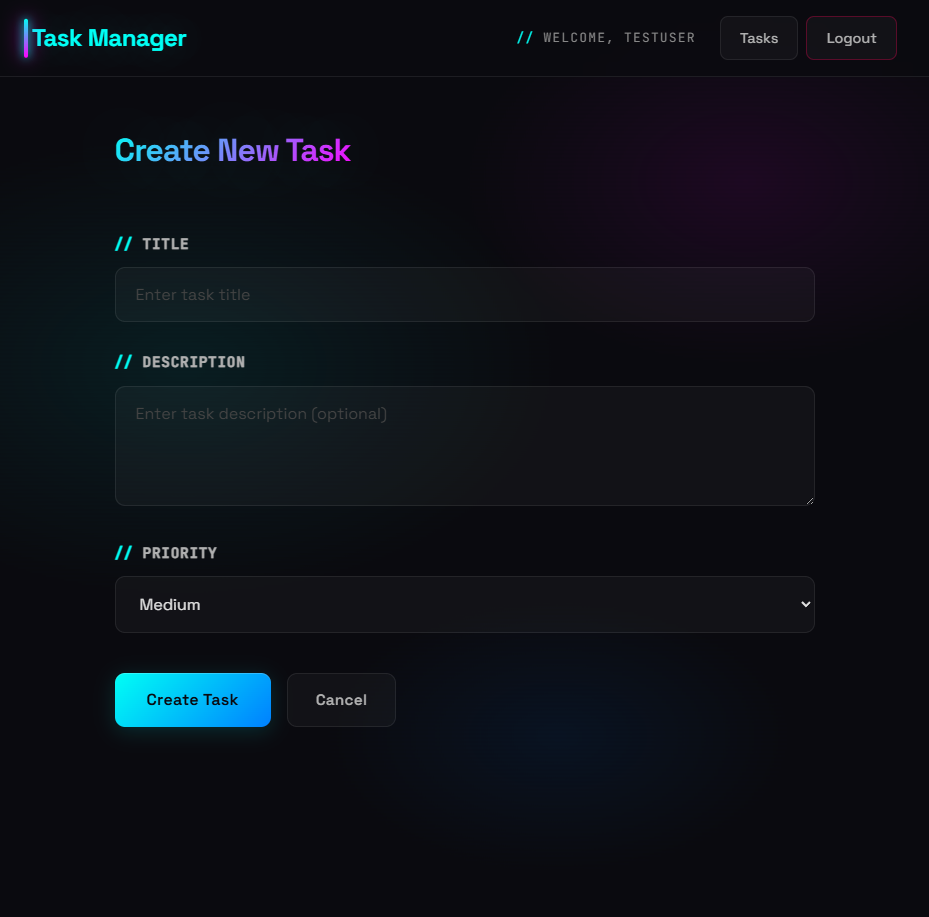
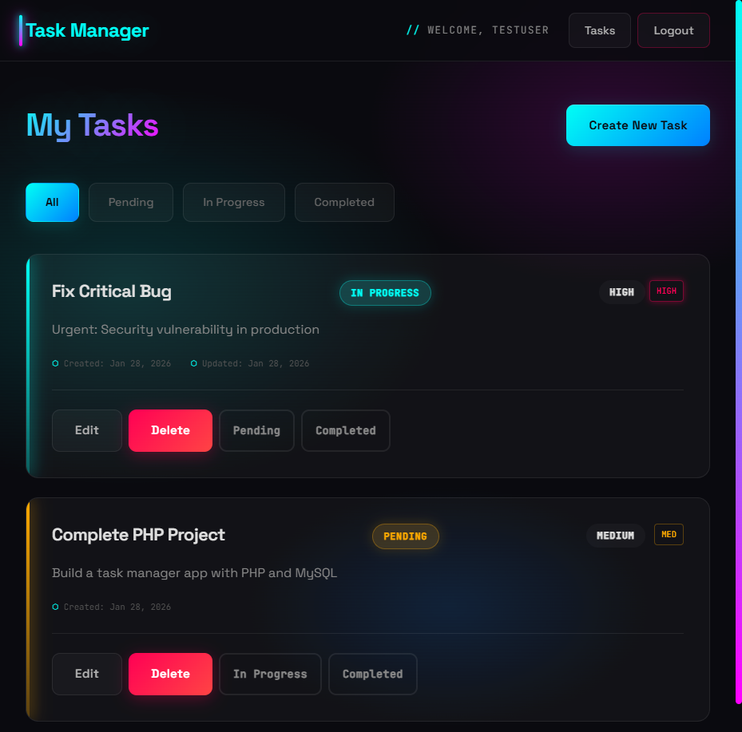

# PHP Task Manager

A simple task management application built with plain PHP, MySQL, and HTML/CSS.

## Features

- User registration and login with secure password hashing
- Create, read, update, and delete tasks
- Task status management (pending, in progress, completed)
- Priority levels (low, medium, high)
- Filter tasks by status
- Server-side validation
- Prepared statements (PDO) for secure database operations

## Technology Stack

- PHP (no framework)
- MySQL database
- PDO for database operations
- HTML5 + CSS3
- Responsive design

## Project Structure

```
php-task-manager/
├── config/
│   └── database.php          # Database connection configuration
├── controllers/
│   ├── AuthController.php   # User authentication logic
│   └── TaskController.php    # Task management logic
├── models/
│   ├── User.php              # User model
│   └── Task.php              # Task model
├── views/
│   ├── auth/
│   │   ├── login.php         # Login page
│   │   └── register.php      # Registration page
│   ├── task/
│   │   ├── index.php         # Task list
│   │   ├── create.php        # Create task form
│   │   ├── edit.php          # Edit task form
│   │   └── delete.php        # Delete confirmation
│   └── layout.php            # Main layout template
├── public/
│   └── css/
│       └── style.css         # Application styles
├── index.php                 # Main entry point
└── schema.sql                # Database schema
```

## Installation

### Docker (recommended)

1. Create your environment file:
   ```bash
   cp .env.example .env
   ```
   The application reads `DB_HOST`, `DB_NAME`, `DB_USER` and `DB_PASSWORD` from the environment. If any is missing, startup stops with a clear error rather than falling back to defaults.

2. Build and start:
   ```bash
   docker compose up -d --build
   ```

3. Open http://localhost:8080. The schema is imported automatically the first time the database volume is created.

See [DOCKER_SETUP.md](DOCKER_SETUP.md) for reset, logs and database commands.

### Without Docker

1. Point a web server with PHP 8.2 and the `pdo_mysql` extension at the project directory.
2. Import the schema: `mysql -u root -p < schema.sql`.
3. Export `DB_HOST`, `DB_NAME`, `DB_USER` and `DB_PASSWORD` before starting the web server.
4. Access the application at http://localhost/

## Screenshots

### Login Page


### Registration Page


### Create Task Form


### Task List with Multiple Tasks


## Usage

1. Register a new account
2. Login with your credentials
3. Create tasks with title, description, and priority
4. Manage tasks (edit, delete, update status)
5. Filter tasks by status

## Development

Used Claude CLI and MCP to generate initial PHP boilerplate, validate SQL queries, refactor controllers, and explain PHP syntax.

## Security

- Password hashing using `password_hash()` and `password_verify()`
- Prepared statements (PDO) to prevent SQL injection
- Session management for user authentication
- Input validation and sanitization
- CSRF protection (recommended for production)

## License

This project is for demonstration purposes.
