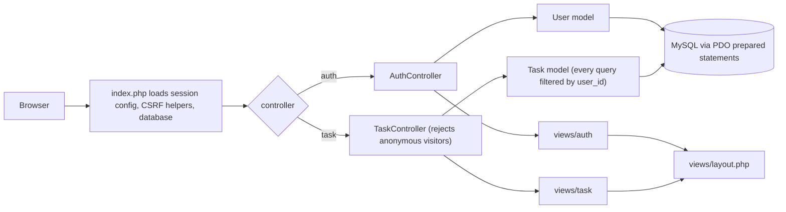
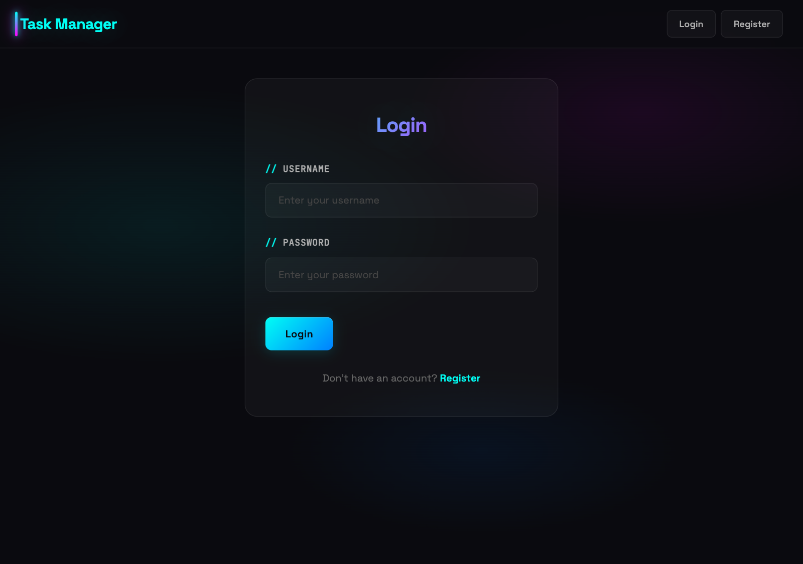
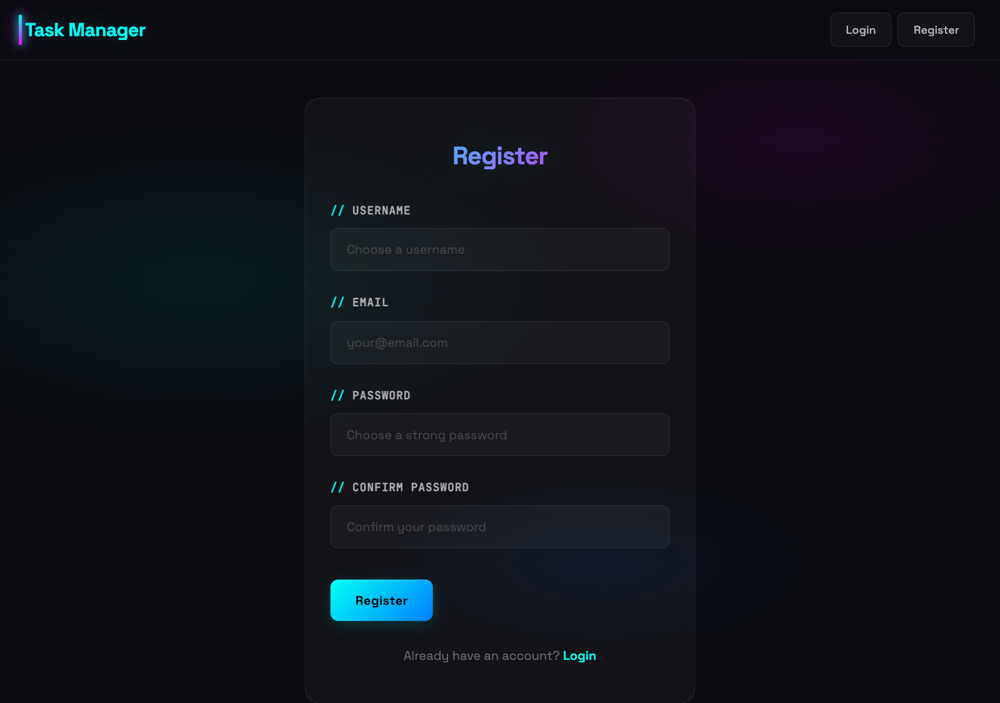
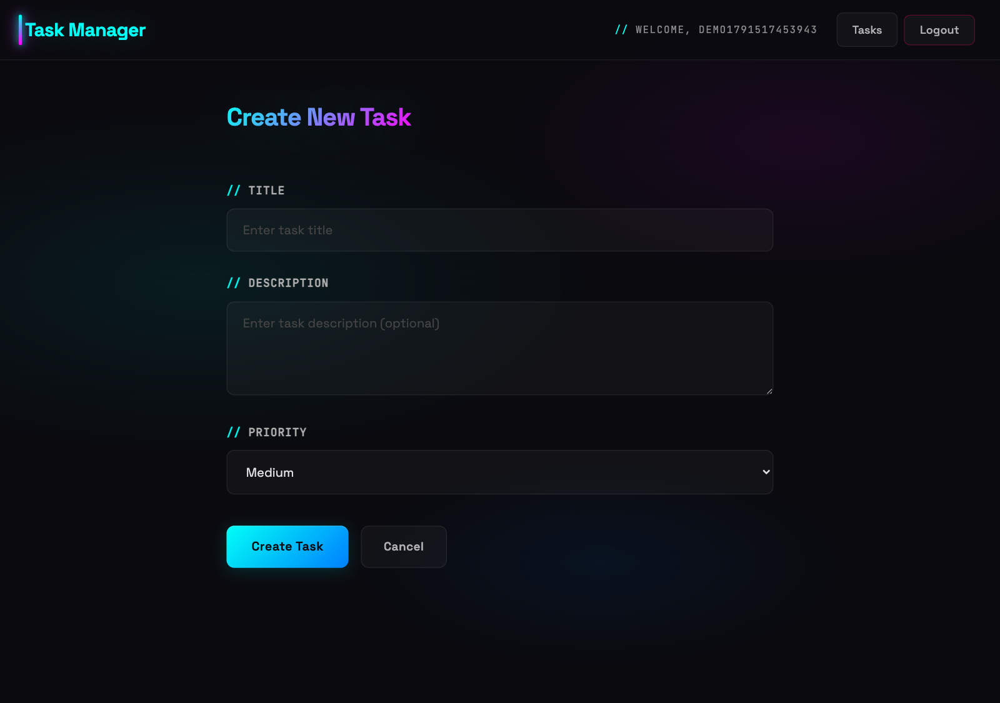
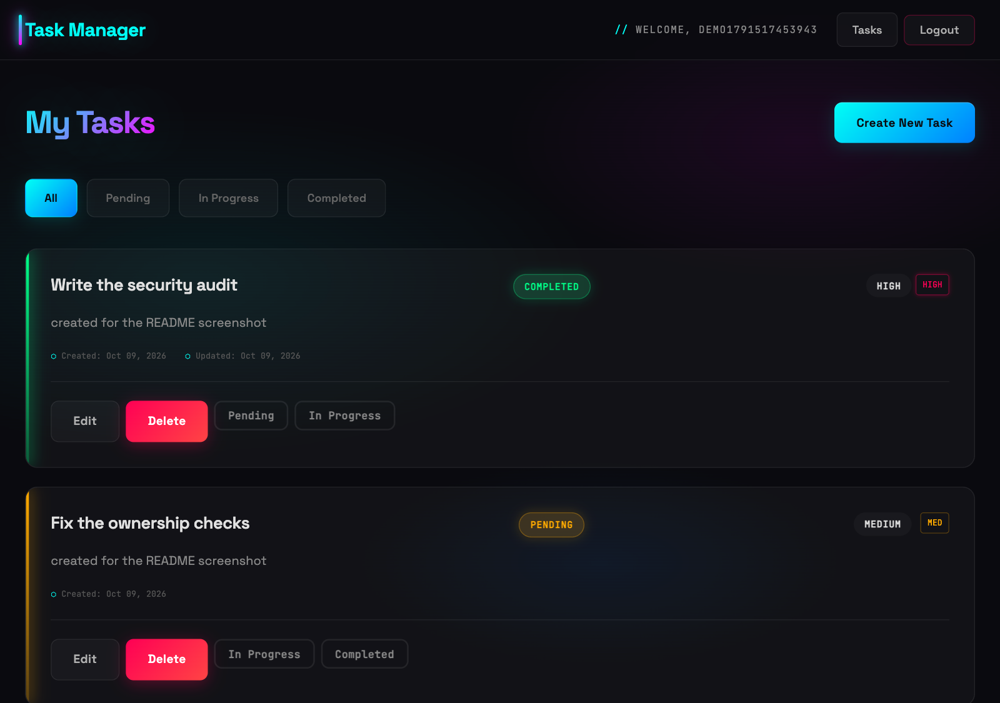

# PHP Task Manager

[](https://github.com/ctru0009/php-task-manager/actions/workflows/ci.yml)
[](#requirements)
[](#requirements)
[](#testing)
[](#)
[](LICENSE)

A task manager in plain PHP with MySQL and PDO. Register, sign in, create tasks with a priority, move them through pending, in progress and completed, filter the list, edit and delete.

The interesting part is not the feature list. It is that the security work is done by hand and each piece has a test that fails when the protection is removed: prepared statements, ownership checks on every task query, CSRF tokens on every POST, hardened session cookies, escaped output, generic login errors, and column limits that turn bad input into a form error instead of a database error.

## Features

- Registration and login with `password_hash` / `password_verify` (bcrypt).
- Task CRUD: title, optional description, priority (low, medium, high).
- Status workflow: pending, in progress, completed; filter the list by status.
- Every task query is scoped to the signed-in user.
- CSRF token on every state-changing request, including logout and status changes.
- Session hardening: id rotation on login, HttpOnly, SameSite=Lax, strict mode.
- Server-side validation for every field, including the column limits in `schema.sql`.

## Requirements

- PHP 8.2 with `pdo_mysql` (the Docker image also installs `dom`, `mbstring`, `xml`, `xmlwriter` for PHPUnit).
- MySQL 8.0.
- Docker and Docker Compose for the documented setup. Composer for dependencies.

## Quick start

```bash
cp .env.example .env
docker compose up -d --build
```

Then open http://localhost:8080. The schema in `schema.sql` is imported automatically the first time the database volume is created.

The application reads `DB_HOST`, `DB_NAME`, `DB_USER` and `DB_PASSWORD` from the environment. If one is missing, startup stops with a message naming the variable instead of silently falling back to a default.

Further commands (reset, logs, MySQL access, troubleshooting) are in [DOCKER_SETUP.md](DOCKER_SETUP.md).

## How a request is handled



## Screenshots

### Login



### Registration



### Creating a task



### Task list with statuses



## Testing

Tests run in the web container against a real MySQL server. There is no database mocking anywhere in the suite.

```bash
docker compose exec web composer install
docker compose exec web php vendor/bin/phpunit          # everything
docker compose exec web composer test:unit              # validation and view rules
docker compose exec web composer test:integration       # HTTP and MySQL
```

The suite creates its own database (`task_manager_test`, built from `schema.sql`) and truncates the tables before each test, so development data is never touched. The bootstrap refuses to run if the database name does not end in `_test`.

| Test class | What it proves |
|---|---|
| `AuthHttpTest` | Registration and login through the real forms: valid input, duplicates, every validation message, boundary lengths, bcrypt hash stored, identical generic message for a wrong password and an unknown user. |
| `SessionTest` | Cookie is HttpOnly and SameSite=Lax, no Secure while disabled, session id rotates on login and registration, POST-only logout, invented session ids are refused. |
| `CsrfTest` | Missing and wrong tokens are rejected with 403 and change nothing, for login, registration, create, edit, delete, status change and logout. |
| `TaskHttpTest`, `EditFormTest`, `LengthValidationTest` | Task CRUD, status and priority rules, status filter, invalid ids, preselected priority, column limits at their boundaries. |
| `IsolationHttpTest` | User B cannot read, edit, delete, re-status or filter user A's task, with the owner's access as the control. |
| `ModelUserTest`, `ModelTaskTest` | Model behaviour against MySQL, including cross-user reads and writes returning nothing and leaving rows untouched. |
| `ViewEscapingTest`, `XssTest` | Hostile payloads stay escaped in every view, including HTML attributes. |
| `ValidationTest` | The validation rules themselves: messages, limits, priority fallback, status filter, id parsing. |

## Security

| Control | How it is implemented | Covered by |
|---|---|---|
| SQL injection | Every query is a PDO prepared statement with placeholders. No string-built SQL in the project. | Model tests exercise the queries; code review covers the rest. |
| Task ownership | `Task` always filters by `user_id`, and the controllers pass the session user. Nothing is readable or writable by id alone. | `IsolationHttpTest`, `ModelTaskTest` |
| CSRF | Token in the session, hidden field in every form, `hash_equals` comparison, 403 page on mismatch. Rotated after login. | `CsrfTest` |
| XSS | `htmlspecialchars` on every dynamic value in the views, including class names and attribute values. | `ViewEscapingTest`, `XssTest` |
| Session fixation | `session_regenerate_id(true)` on login and registration, `session.use_strict_mode=1`. | `SessionTest` |
| Session cookies | HttpOnly and SameSite=Lax always, Secure through `SESSION_COOKIE_SECURE=1` on HTTPS. | `SessionTest` |
| Password storage | `password_hash` with `PASSWORD_DEFAULT` (bcrypt) and `password_verify`; hashes are never returned by the user model. | `AuthHttpTest`, `ModelUserTest` |
| Login errors | One generic message for a wrong password and for an unknown user, so the form does not confirm whether an account exists. | `AuthHttpTest` |
| Bad input | Validation runs before the database: limits match the columns, invalid ids redirect, arrays are treated as empty strings. | `ValidationTest`, `LengthValidationTest`, `TaskHttpTest` |
| Error output | `display_errors=Off` in the image, users get short generic messages, details go to `docker compose logs web`. Duplicate accounts are the only database error shown to users. | `AuthHttpTest` asserts no SQLSTATE text; manually verified for the connection failure path. |
| Configuration | `DB_*` variables are required; a missing one stops the request with a clear message and a failed connection returns a generic 500. | Manually verified: missing variable, unreachable host. |

## Limitations

This is a portfolio project with a demo setup. What it deliberately does not do:

- No rate limiting, account lockout or CAPTCHA on login, so brute force is possible.
- No password reset, email verification, remember me, or account management.
- Registration can still be used to probe whether a username or email exists, through the duplicate message. Fixing that trades away clear feedback for a legitimate user.
- The MySQL root account is used for simplicity, and credentials live in a local `.env`. A real deployment would use a least-privilege user and a secret manager.
- No custom 500 page: unexpected failures return the server's default error page while the details land in the log.
- The test suite drives PHP's built-in server rather than Apache, so Apache-specific behaviour (rewrite rules, server headers) is not covered.
- Single language, server timezone dates, no pagination on the task list.
- Dates and the task list order rely on MySQL timestamps; tasks created within the same second are not ordered against each other.

## Project structure

```
php-task-manager/
├── config/
│   ├── database.php          # PDO connection from environment variables, fails closed
│   └── session.php           # cookie flags and strict mode, loaded before session_start
├── controllers/
│   ├── AuthController.php    # register, login, logout
│   └── TaskController.php    # list, create, edit, delete, status change
├── models/
│   ├── User.php              # registration, login, lookup
│   └── Task.php              # every query filtered by user_id
├── includes/
│   ├── validation.php        # pure validation rules, shared and unit tested
│   ├── csrf.php              # token creation, form field, verification, rotation
│   └── exceptions.php        # ValidationException for rule violations
├── views/
│   ├── layout.php            # html shell, navigation
│   ├── auth/                 # login, register
│   ├── task/                 # list, create, edit, delete confirmation
│   └── errors/403.php
├── tests/
│   ├── Unit/                 # validation rules, view escaping
│   ├── Integration/          # HTTP and MySQL behaviour
│   └── Support/              # test database, HTTP client, server boot
├── docs/screenshots/
├── public/css/style.css
├── schema.sql
├── index.php                 # front controller
├── docker-compose.yml
└── Dockerfile
```

## Development

The initial boilerplate was generated with a coding agent (Claude CLI with MCP servers) and then reworked by hand. I reviewed and verified the result, including the changes in this repository: the test suite passes locally and in CI, and every protection listed above was checked by removing it and watching the relevant test fail.

The PHP concepts used here are explained in [PHP_CONCEPTS.md](PHP_CONCEPTS.md).

## Licence

MIT. See [LICENSE](LICENSE).
